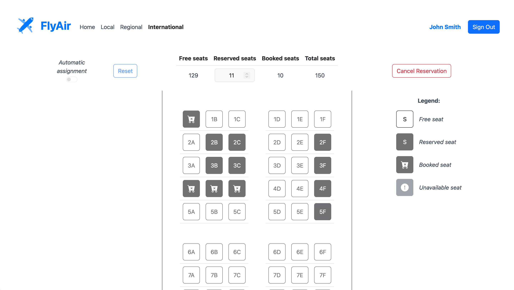

[](https://classroom.github.com/a/_8yXOlwa)
# Exam #2: "PostiAereo"
## Student: s317669 DINOCCA GRAZIANO FRANCESCO 

## React Client Application Routes

- Route `/*`: (default) welcome page
- Route `/login`: login page
- Route `/seats/:plane`: status and seats grid page for each `<plane>`

## API Server
  ### Authentication
- GET `/api/booking/sessions/current`
  - Description: Get the current authenticated user session (if exists)

  - Request body: _None_

  - Response: `200 OK` (success) or `401 Not Authenticated` (unauthenticated).

  - Response body: An object containing user information (Content-Type: `application/json`)
    ```
    {
      "id": 1,
      "username": "test1@polito.it",
      "name": "John",
      "surname": "Smith"
    }
    ```
- POST `/api/booking/sessions`
  - Description: Authenticate the user (if registered)

  - Request body: An object containing user credentials (Content-Type: `application/json`)
    ```
     { 
       "username": "test1@polito.it",
       "password": "password"
     }
    ```

  - Response: `200 OK` (success) or `401 Not Authenticated` (unauthenticated).

  - Response body: An object containing user information (Content-Type: `application/json`)
    ```
    {
      "id": 1,
      "username": "test1@polito.it",
      "name": "John",
      "surname": "Smith"
    }
    ```
- DELETE `/api/booking/sessions/current`
  - Description: Delete the current user session

  - Request body: _None_

  - Response: `200 OK` (success).

  - Response body: _None_

### Application
- GET `/api/seats`
  - Description: Get the type, the number of lines and the number of seats-per-line for each plane type.

  - Request body: _None_

  - Response: `200 OK` (success), `204 No Content` (success but no flight found to start application) or `500 Internal Server Error` (generic error).

  - Response body: An array of objects, each containing the type, the number of lines and the number of seats-per-line for each plane type as shown below (Content-Type: `application/json`) otherwise an empty response body (if no flight exists)
    ```
      [
        {
           "type": "local",
           "lines": 15,
           "seats": 4
        },
        {
           "type": "regional",
           "lines": 20, 
           "seats": 5 
        },
        {  
           "type": "international",
           "lines": 25,
           "seats": 6 
        }
      ]
    ```
- GET `/api/booking/seats/:type/booked`
  - Description: Get the booked seats for flight `<type>`.

  - Request body: _None_

  - Response: `200 OK` (success), `404 Flight Not Found` (invalid plane type) or `500 Internal Server Error` (generic error).

  - Response body: An object which contains an array of seat objects as shown below (Content-Type: `application/json`)
    ```
    {
      "booked": 
      [
        {
          "seat": "1A"
        },
        {
          "seat": "2B"
        }, 
        ...
      ]
    }
    ```
- GET `/api/booking/seats/:type/reserved` - `Authenticated`
  - Description: Get the user reserved seats and all the other booked seats for a given plane `<type>`.

  - Request body: _None_

  - Response: `200 OK` (success), `401 Not Authenticated` (unauthenticated user), `404 Flight Not Found` (invalid plane type) or `500 Internal Server Error` (generic error).

  - Response body: An object which contains an array of user reserved seats and an array of other users booked seats objects as shown below (Content-Type: `application/json`)
    ```
    {
      "booked": 
      [
        {
          "seat": "1A"
        },
        {
          "seat": "2B"
        },
        ...
      ],
      "reserved": 
      [
        {
          "seat": "2A"
        },
        {
          "seat": "3B"
        },
        ...
      ]
    }
    ```
- DELETE `/api/booking/seats/:type/reserved` - `Authenticated`
  - Description: Delete a previuos user's seats reservation for a given plane `<type>` (if exists).

  - Request body: _None_

  - Response: `200 OK` (success), `401 Not Authenticated` (unauthenticated user), `404 Flight Not Found` (invalid plane type), `404 Reservation Not Found` (invalid reservation) or `500 Internal Server Error` (generic error).

  - Response body: _None_
    
- POST `/api/booking/seats/:type` - `Authenticated`
  - Description: Start a transaction to add the user reservation for a given plane `<type>`.

  - Request body: An object containing a list of seats to be reserved as shown below (Content-Type: `application/json`)
    ```
      {
        "seats": 
        [
          {
            "seat": "1A"
          },
          {
            "seat": "2B"
          },
          ...
        ]
      }
    ```

  - Response: `200 OK` (success), `401 Not Authenticated` (unauthenticated user), `404 Flight Not Found` (invalid plane type), `409 Conflict` (reservation is conflicting with a reservation committed by another user), `422 Unprocessable entity` (seats object format not valid) or `500 Internal Server Error` (generic error).

  - Response body: In case of success, an object which contains an array of user reserved seat objects and an array of other users booked seat objects (Content-Type: `application/json`) otherwise an object containing an array of conflicting seats as shown below (Content-Type: `application/json`)
    ```
    {
      "booked": 
      [
        {
          "seat": "1A"
        },
        {
          "seat": "2B"
        },
        ...
      ],
      "reserved": 
      [
        {
          "seat": "2A"
        },
        {
          "seat": "3B"
        },
        ...
      ]
    }
    ```
    ```
    {
      "conflicts": 
      [
        {
          "seat": "1A"
        },
        {
          "seat": "2B"
        }
      ]
    }
    ```

## Database Tables

- Table `users` - contains `userID`, `email`, `name`, `surname`, `salt`, `hash` for each user
- Table `flights` - contains `flightID`, `type`, `lines`, `seats` for each type of flight
- Table `reservations` - contains `flightID`, `userID`, `seat` for each seat in users' reservations

## Main React Components

- `Seat` (in `Seat.jsx`): displays a seat as a button
- `Booking` (in `Booking.jsx`): renders the Seat components grid together with status table and control buttons
- `Legend` (in `Legend.jsx`): displays a legend for the seats grid
- `Welcome` (in `Welcome.jsx`): renders a welcome page (default page)
- `Status` (in `Status.jsx`): displays a status table for the selected flight

## Screenshot


## Users Credentials

- User: "test1@polito.it", Password: "password" - with a reservation on `Local` and `International`
- User: "test2@polito.it", Password: "password"
- User: "test3@polito.it", Password: "password" - with a reservation on `Regional` and `International`
- User: "test4@polito.it", Password: "password"

